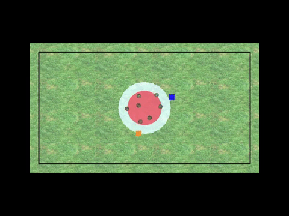
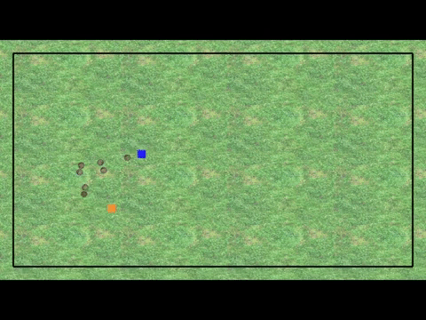
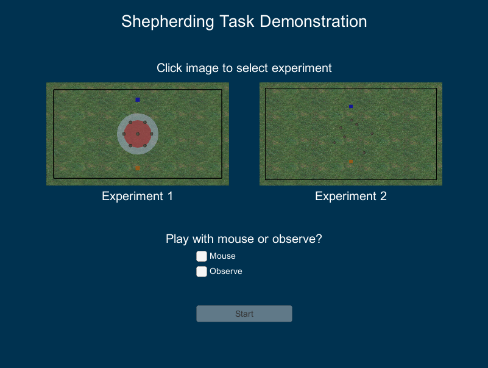

# Human Social-Motor Solutions for Human-Machine Interaction in Dynamical Task Contexts

Code repository for the Dyadic Shepherding Task.  
The repository is managed by Dr. Patrick Nalepka ([@ShortFox](https://github.com/ShortFox) and Prof. Michael J. Richardson ([@xkiwilabs](https://github.com/xkiwilabs)).





### Acknowledgements
When referencing the original study investigating human coordination during the dyadic shepherding task, please cite the following:  
- Nalepka, P., Kallen, R. W., Chemero, A., Saltzman, E., & Richardson, M. J. (2017). Herd those sheep: Emergent multi-agent coordination and behavioral mode switching. *Psychological Science*, *28*(5), 630-650.

When referencing the original study investigating human-machine interaction during the dyadic shepherding task, and when using code taken from this repository, please cite the following:  
- TBD

### Background Information and Web Player
[Click here](http://xkiwilabs.com/hmi-shepherding/) for background information regarding the work, a video, and an online web player to play/watch the dyadic shepherding task (note: you will be prompted to install Unity WebGL to use the web player).

### Using Compiled Version of Software
To play the shepherding task with the artificial-agent, or to observe two artificial-agents complete the task, download the contents inside the subfolder that matches your operating system located in the ```Compiled Software``` folder. Note, all the contents need to be in the same location for the software to run.

1. Open the executable. The following screen should appear:

  

1. Click on the experiment image you would like to play/watch.
1. Select one of the following options:  
  * **Mouse** to control the orange cube/sheepdog and play with the artificial-agent using your mouse.
  * **Observe** to watch two artificial-agents complete the task.

1. Select **Start** to initiate the task environment.
  * If playing, move your player to the black start location located near the bottom of the game screen to initiate a trial.
1. To return to the title screen at any time, press the Escape key.

### Code Contents
Note: Unity is required to view and edit the software. The code was created and tested using [Unity Release 2017.4.16f1](https://unity3d.com/unity/qa/lts-releases).
- Once downloaded, import the Unity package titled ```Human-Machine-Shepherding```

Summary of content within the ```Scripts``` folder.
* Common Scripts
  * ```MenuGUI``` Handles interaction with TitleScreen scene.
  * ```SheepDynamics``` Handles the behavior of the sheep for both Experiments 1 and 2.
* Experiment 1 Scripts
  * ```Game_Director_Exp1``` Handles trial management for Experiment 1.
  * ```Dog_Behavior_ArtificialAgent_Exp1``` Handles sheep selection and player/artificial-agent behavior for Experiment 1.
  * ```FenceCollideCheck_Exp1``` Sends trial failure message to ```Game_Director_Exp1``` on sheep collision with fence.
* Experiment 2 Scripts
  * ```Game_Director_Exp2``` Handles trial management for Experiment 2.
  * ```Dog_Behavior_ArtificialAgent_Exp2``` Handles sheep selection and player/artificial-agent behavior for Experiment 2.
  * ```FenceCollideCheck_Exp2``` Sends repulsive force when sheep makes collision with fence.

Comments are included throughout to assist with comprehension.
